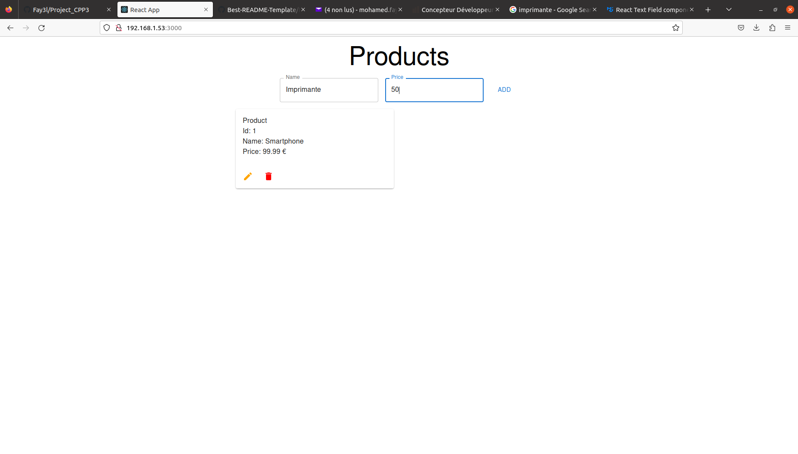
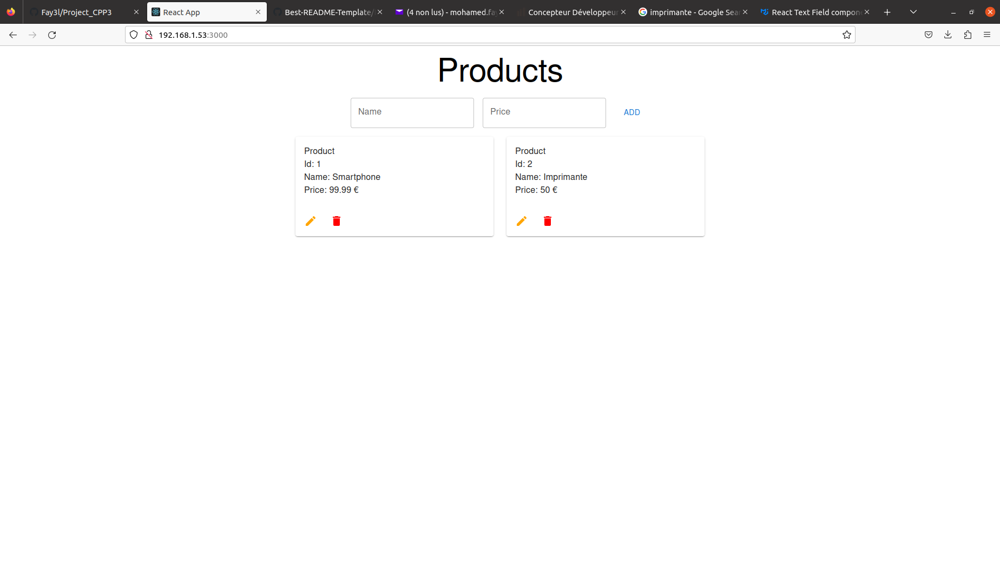
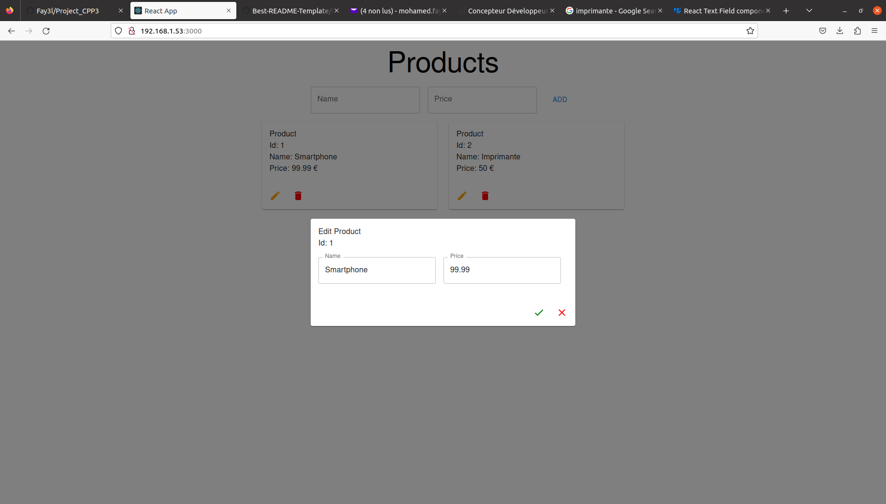
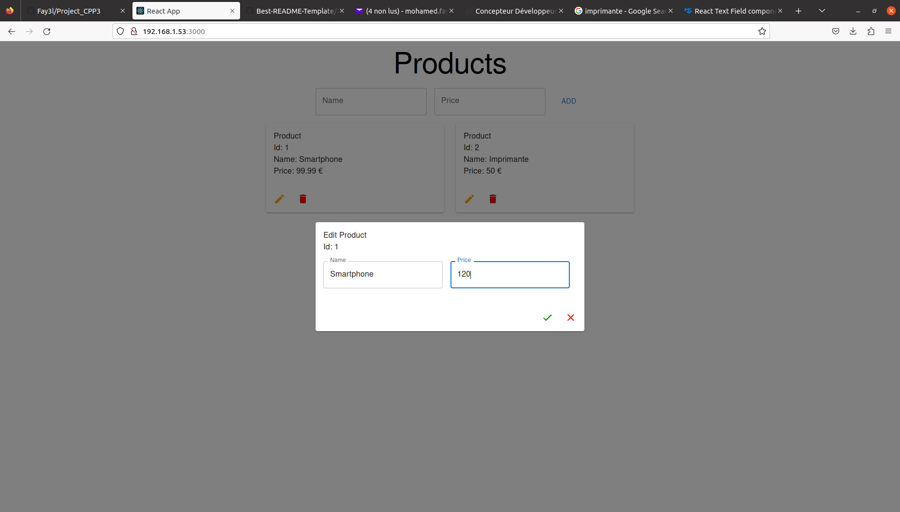
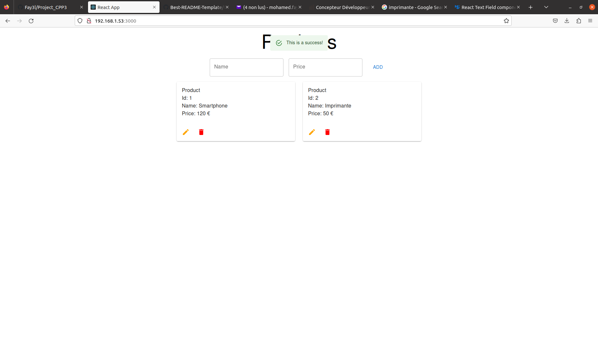
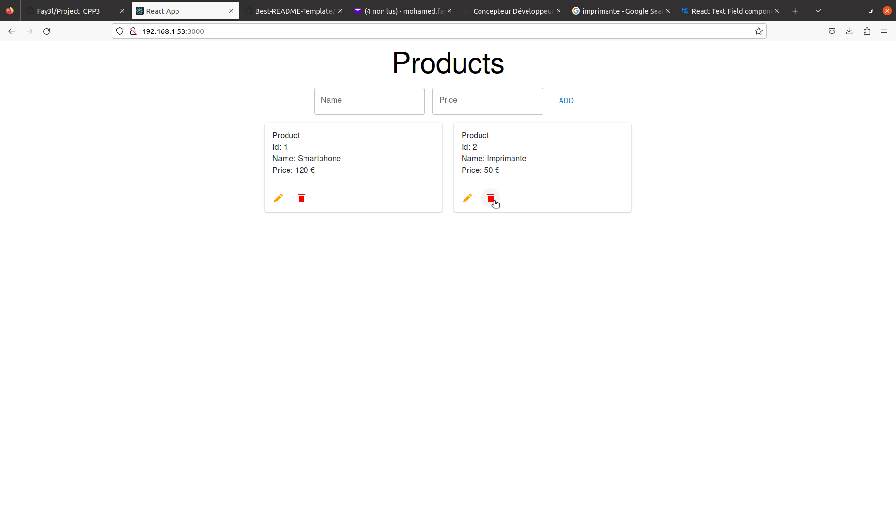
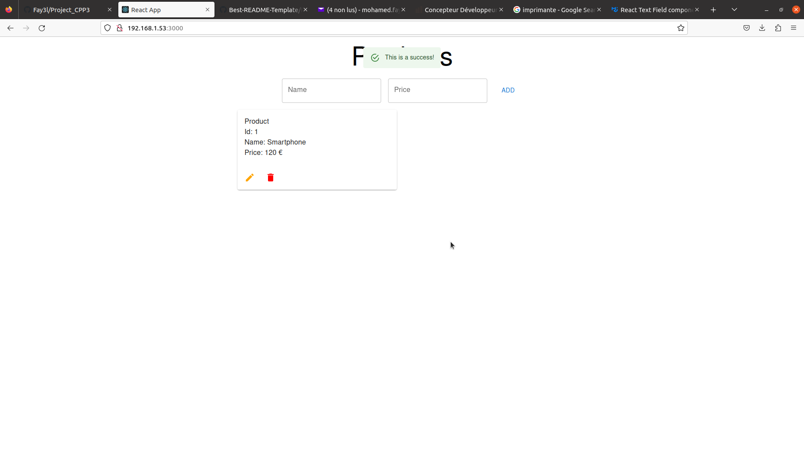

# Project_CPP3

<summary>Table of Contents</summary>
  <ol>
    <li><a href="#about-the-project">About The Project</a></li>
    <li><a href="#built-with">Built With</a></li>
    <li><a href="#run-docker">Run Docker</a></li>
    <li><a href="#run-locally">Run Locally</a></li>
    <li><a href="#application">Application</a></li>
    <li><a href="#contact">Contact</a></li>
  </ol>

## About The Project

Le concepteur développeur d’applications conçoit et développe des services numériques à destination des utilisateurs en respectant les
normes et standards reconnus par la profession et en suivant l’état de l’art de la sécurité informatique à toutes les étapes. La connaissance du métier du client pour lequel il réalise l’application peut être demandée. Il prend en compte les contraintes économiques, en termes de coûts et de délais, les exigences de sécurité propres à son domaine d’intervention. Il peut aussi être amené, à la demande du client, à intégrer les principes liés à la conception responsable de services numériques.

Pour concevoir et développer une application multicouche répartie, il analyse la demande en s’appuyant sur une démarche permettant de construire les services numériques en plusieurs couches correspondant aux couches présentation, métier et persistance. Il s’adapte en continu aux évolutions technologiques et réglementaires de la filière Etudes et développement.

<p><a href="https://file.notion.so/f/s/82e4a272-dd0f-482e-84e5-d8d38c371f18/REAC_CDA_V03_03052018.pdf?id=d2b4ec65-f049-4d2d-9645-155b364a981b&table=block&spaceId=a94bc9d5-8c9c-4ca2-b19a-4216721b20f3&expirationTimestamp=1693663200000&signature=OwmdKZW900oZtLCwL2CJQH9SpVqYPlLS_LzzkN_OWbo&downloadName=REAC_CDA_V03_03052018.pdf">File PDF</a></p>

## Built With

* [![React][React.js]][React-url]
* [![Python][Python.js]][Python-url]
* [![PostgreSql][PostgreSql.js]][PostgreSql-url]

<p align="right">(<a href="#project_cpp3">back to top</a>)</p>

## Run Docker

Run containers in the background, print new container names.
```bash
docker-compose up -d
```
Build images before starting containers.
```bash
docker-compose up --build
```

<p align="right">(<a href="#project_cpp3">back to top</a>)</p>

## Run Locally

Start the server frontend

```bash
  npm run start
```

Start the server backend

```bash
  uvicorn api:app --host 0.0.0.0 --port 8000
```
<p align="right">(<a href="#project_cpp3">back to top</a>)</p>

## Application

#### Add product

</img>
</img>

#### Edit product

</img>
</img>
</img>

#### Remove product

</img>
</img>

<p align="right">(<a href="#project_cpp3">back to top</a>)</p>

## Contact

Email: mohamed.fayel@yahoo.com
Github: Fay3l


[React.js]: https://img.shields.io/badge/React-20232A?style=for-the-badge&logo=react&logoColor=61DAFB
[React-url]: https://reactjs.org/
[Python.js]: https://img.shields.io/badge/Python-20232A?style=for-the-badge&logo=python&logoColor=61DAFB
[Python-url]: https://www.python.org/
[PostgreSql.js]: https://img.shields.io/badge/Postgresql-20232A?style=for-the-badge&logo=postgresql&logoColor=61DAFB
[PostgreSql-url]: https://www.postgresql.org/